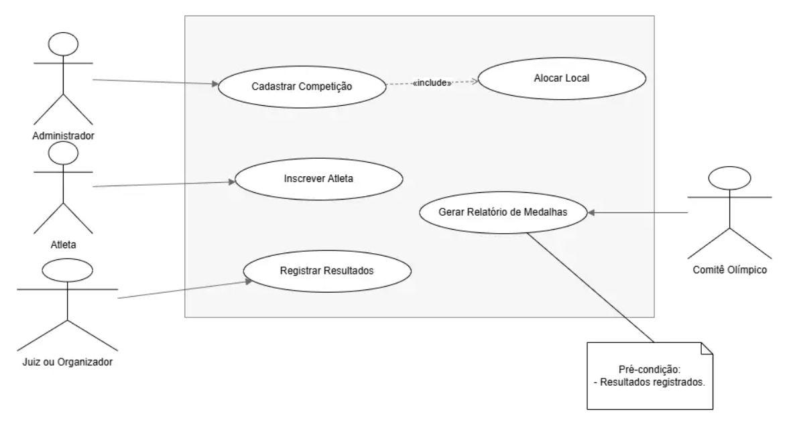
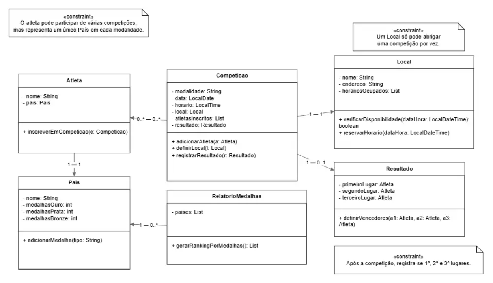
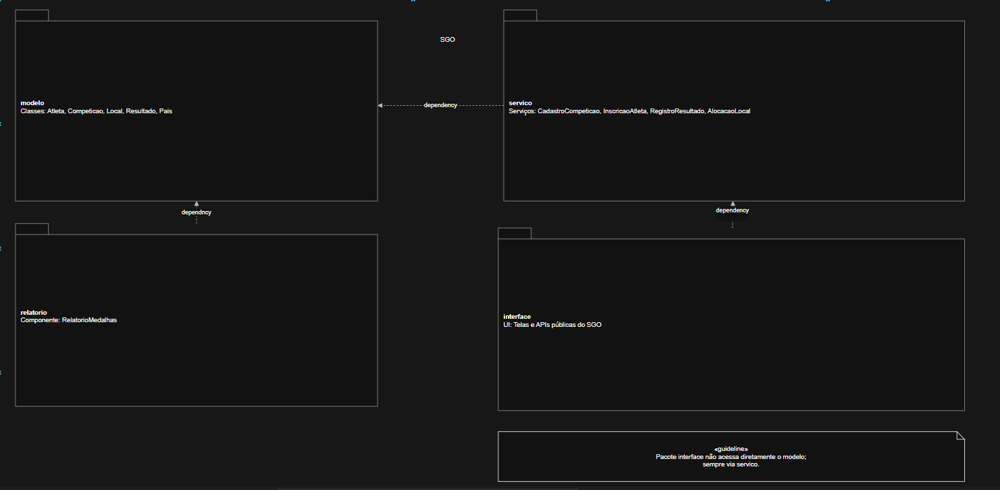
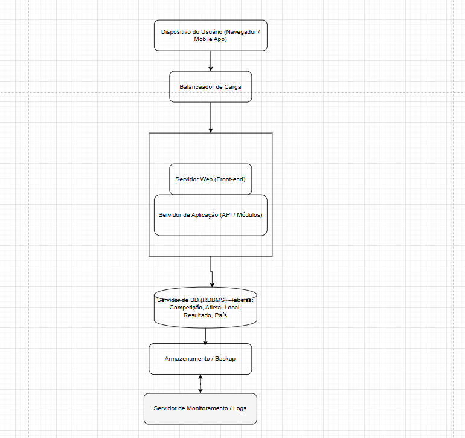

# Sistema de Gestão Olímpica (SGO)

O objetivo do projeto é modelar o **Sistema de Gestão Olímpica (SGO)** utilizando diagramas UML, abordando desde os casos de uso até a implantação.

---

## 📁 Estrutura do Repositório

| Pasta | Conteúdo |
|--------|-----------|
| **/imagens** | Diagramas exportados em formato `.png` |
| **/modelagens** | Arquivos-fonte dos diagramas em formato `.drawio` |

---

## 📊 Diagramas UML

### 1. Diagrama de Caso de Uso

---

### 2. Diagrama de Classes

---

### 3. Diagrama de Pacotes

---

### 4. Diagrama de Componentes

---

### 5. Diagrama de Implantação

---

## 👥 Autores

- **Arthur Candian**
- **Arthur Pedra**

PUC Minas – Engenharia de Software  

